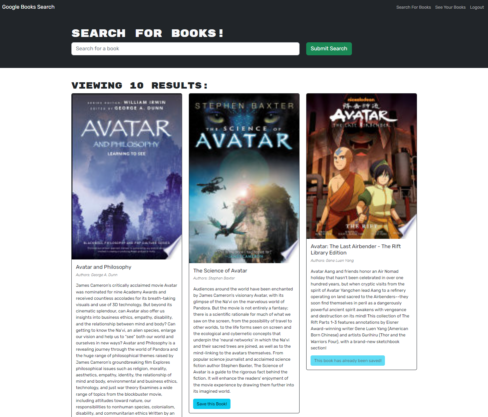

# Google_Book_Search

A book search engine using Google API, where you can create a login and save your favorite books

## Description

Google_Book_Search was build whit a RESTful API and we needed to Refactor it to use GraphQL built in Apollo Server. I started adding, modifying and erasing the necessary files on the back and using ApolloGraphQL sandbox for testing the queries and mutations ensuring that, at the end I have a functioning server side. I work on the client side the same approach as the server side. This was an exiting and challenge process where I discovered the differences between the RESTful and GraphQL. 

## Table of Contents

  - [Installation](#Installation)
  - [Usage](#Usage)
  - [License](#License)
  - [Contributions](#Contributions)
  - [Test](#Test)
  - [Questions](#Questions)

## Installation

This application runs in the browser and requires the following packages:
- [apollo-server-express](https://www.npmjs.com/package/apollo-server-express)
- [bcrypt](https://www.npmjs.com/package/bcrypt)
- [express](https://www.npmjs.com/package/express)
- [graphql](https://www.npmjs.com/package/graphql)
- [jsonwebtoken](https://www.npmjs.com/package/jsonwebtoken)
- [mongoose](https://www.npmjs.com/package/mongoose)
- [nodemon](https://www.npmjs.com/package/nodemon)
- [@apollo/client](https://www.npmjs.com/package/@apollo/client)
- [@testing-library/jest-dom](https://www.npmjs.com/package/@testing-library/jest-dom)
- [@testing-library/react](https://www.npmjs.com/package/@testing-library/react)
- [@testing-library/user-event](https://www.npmjs.com/package/@testing-library/user-event)
- [bootstrap](https://www.npmjs.com/package/bootstrap)
- [jwt-decode](https://www.npmjs.com/package/jwt-decode)
- [react](https://www.npmjs.com/package/react)
- [react-bootstrap](https://www.npmjs.com/package/react-bootstrap)
- [react-dom](https://www.npmjs.com/package/react-dom)
- [react-router-dom](https://www.npmjs.com/package/react-router-dom)
- [react-scripts](https://www.npmjs.com/package/react-scripts)
- [web-vitals](https://www.npmjs.com/package/web-vitals)
- [concurrently](https://www.npmjs.com/package/concurrently)

## Links

Github repository site here: [https://github.com/FranklynSuriel/Google_Book_Search](https://github.com/FranklynSuriel/Google_Book_Search)

Deployed site here: [https://protected-lake-70730.herokuapp.com/](https://protected-lake-70730.herokuapp.com/)

## Usage

Open it in the browser. The landing page you can **search for books**. You can sign up or login. If you click **login/signup** a modal will appear with the options of login or signup. You can click the toogle button to change the option. After you login, the options **Search for books, See your books or logout** will show on the navbar. When you do a search alter login, each book will show a button to save this book to your collection. If you click **Save this book!** button, you book will be added to you collection. If the book is already saved, the button will indicate that the book is already saved. If you click on **See your books**, you will be presented with all the saved books and each book will have a button with the option to delete your book. If you click **logout** you will logout from the application.

## Credits

Documentation(s) and webpage(s):

- apolloDocs
- Stack Overflow
- BootCamp Repo

## License

This project is licensed under the MIT license.

## Contributing

No contributions guidelines.

## Test

No test available.

## Questions

[github.com/FranklynSuriel](https://github.com/FranklynSuriel)

Questions about this project or to report an issue can be sent to:

- fsuriel@gmail.com. 

Please specify the name of the project in the subject of the email.
